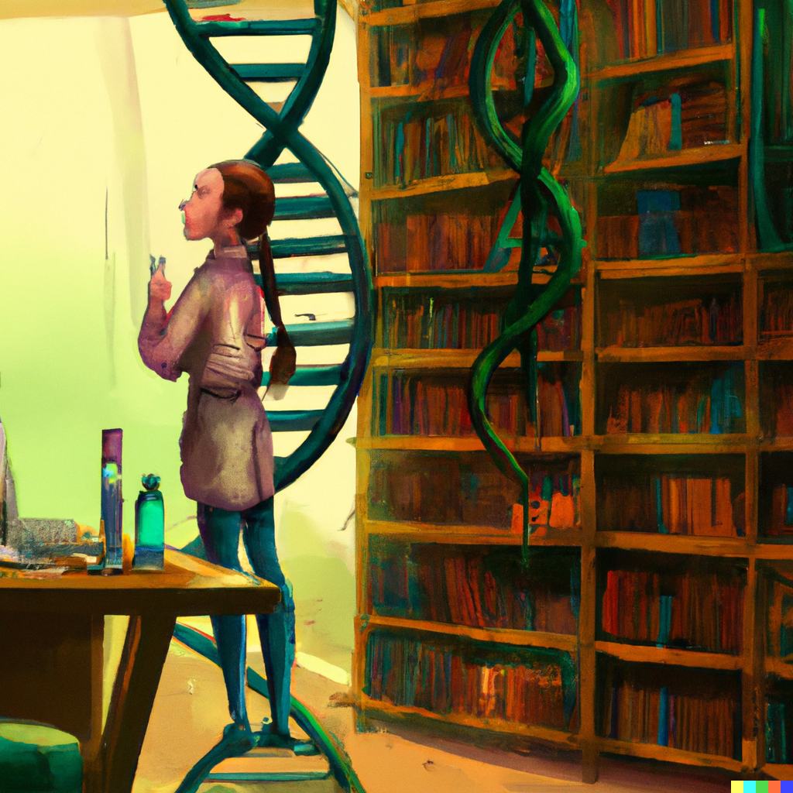

# Resume at a Glance

Daniella Matute is a synthetic and computational biologist with over five years of experience in BSL-2 labs and six years of programming and data analysis experience. 

- Specialty: the combination of **engineering principles (DBTL)** and **molecular biology techniques**. 
- Goal: to make "The Century of Biology" a reality and transform biology into a formalized engineering field. 
- Looking for: a multidisciplinary position with access to lab-automation platforms. 

- Traits: extroverted, analytical, precise, data-driven and quite funny.

### Laboratory skills (summarised list)
|Molecular Biology|  Biochemical/Biophysical Assays|Other|
|:----------------|:-------------------------------|:----|
|DNA and RNA isolation| spectroscopy  |cell culture|
|Electrophoresis|chromatography techniques  |media preparation|
|DNA restriction|  |basic lab maintenance|
|plasmid cloning |  ||
|cell lysis |  ||
|protein purification |  ||
|protein expression|||||

### Computation skills (summarised list)
|Languages|Code Editors|SynBio & Bioinformatic Tools|Other|
|:--------|:-----------|:----|:------------------|
|Python|Jupyter Notebooks|PyMol|Linux/Unix|
|SQL|VSC|SNAPgene|Command Line|
|R|RStudio|WGA|Visualisation|
|MATLAB|PyCharm|Alignment|Machine Learning|
|HTML|Qiime2||Diverse Python Packages|

### Experience In:
- Automation engineering
- Metagenomic/taxonomic analysis
- Stem cell lineage determination computational modeling
- Drug treatment profiling for Cancer
- Pharmaceutical Marketing, R&D, and Regulatory Affairs
- *and much more*

### Education:
- The University of Edinburgh (Scotland) Distinction Award & 4.0 GPA

  *Master of Science in Synthetic Biology & Biotechnology* 
- George Mason University (VA, USA) - Cum Laude Award & 3.63 GPA				

  *Bachelor of Science in Biology* - Concentration in Molecular biology and Biotechnology & Minor in Business
- Professional Development: Machine Learning & Data Science Bootcamp (in progress), Unit-testing, Git Versioning.

Fluent in Spanish and English.

